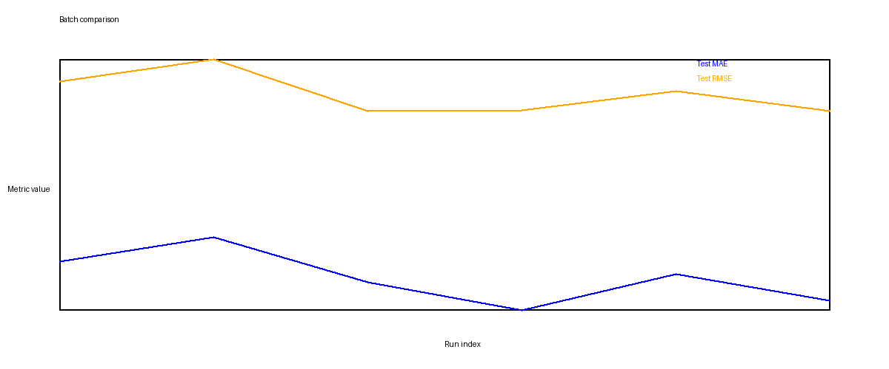

# Exp.1.a / Exp.1.b Results Snapshot

This is the tracked summary for the completed assigned Experiment 1 runs.

Included scope:

- `Exp.1.a CNN-BiLSTM`
- `Exp.1.b CNN-xLSTM`

Excluded from this historical Exp.1.a/b results batch:

- `Exp.1.c CNN-BiLSTM-Transformer`
- `Exp.1.d CNN-Transformer`

## Comparison Figure

## Final Test Metrics

Lower is better for `MAE` and `RMSE`.

| Experiment | Preprocess | Test MAE | Test RMSE | Test MAPE |
| --- | --- | ---: | ---: | ---: |
| `exp1a_cnn_bilstm` | `norm` | 29.6499 | 41.2486 | 4114.6316 |
| `exp1a_cnn_bilstm` | `wavelet` | 28.2966 | 39.3126 | 3141.0965 |
| `exp1a_cnn_bilstm` | `patch` | 31.2233 | 42.6750 | 4408.1151 |
| `exp1b_cnn_xlstm` | `norm` | 26.5345 | 39.3580 | 4172.5943 |
| `exp1b_cnn_xlstm` | `wavelet` | 27.1211 | 39.3053 | 3918.8283 |
| `exp1b_cnn_xlstm` | `patch` | 28.8341 | 40.6153 | 4161.9200 |

## Quick Read

- Best `MAE`: `CNN-xLSTM + norm`
- Best `RMSE`: `CNN-xLSTM + wavelet`
- Best `CNN-BiLSTM` configuration in this batch: `wavelet`
- Weakest preprocessing for both models in this batch: `patch`

## Notes

- `MAPE` is large because the target includes values close to zero, which makes percentage errors unstable.
- For comparison, `MAE` and `RMSE` are the better metrics to trust.
- Full generated run artifacts still live under `outputs/`, but those files are intentionally gitignored.
- Exp.1.c/d are not part of this snapshot, but they now have shared
  `ml_pipeline` wrappers in `ml_pipeline/models/exp1_cd_models.py`.
